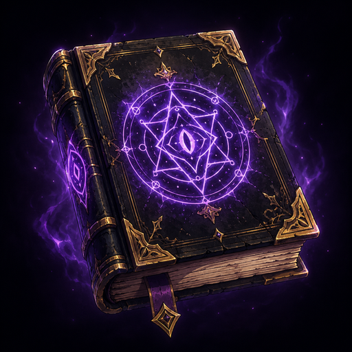

<div align="center">
	<h1>Apocrypha</h1>
	
	<br/> <br/>
    <b>Canon is just the beginning.</b>
    <br/>
    The Linux-first mod platform.
    <br/><br/>
    <a href="https://github.com/Jeagermeister/Apocrypha/actions/workflows/clean_environment_tests.yaml" target="_blank"></a>
    <a href="https://github.com/Jeagermeister/Apocrypha/blob/linux-fork/LICENSE.md" target="_blank"></a>
</div>

**Apocrypha** is a mod manager built for Linux first: one app, one Library, and one
loadout model for your whole modding life — whatever the game, whatever the source.

> *Apocrypha (n.): the writings left out of the official canon.* In other words: mods.

## Why Apocrypha is different

- **Loadouts work like git.** Every change to your mod setup is a revision in an
  event-sourced datastore (MnemonicDB). Diff it, revert it, keep parallel loadouts of the
  same game — applying is a 3-way merge against your disk, never a blind overwrite.
- **Mod sources are peers, not silos.** Nexus Mods (`nxm://` one-click, collections, API)
  and Thunderstore (`ror2mm://` one-click, dependency resolution) live side by side in the
  same Library and the same loadout. Modrinth/Minecraft support is on the roadmap.
- **Linux is the first-class citizen.** Proton prefixes are handled automatically (BepInEx's
  `winhttp.dll` override is written into `user.reg` at launch — no launch-options ritual),
  protocol handlers register via xdg, and the whole app is developed and tested on Linux.
- **Your installs stay safe.** Game versions are recognized *locally* by hashing installed
  files against Steam's own depot manifests — no login, no re-download — so vanilla files
  are known, protected, and restorable.
- **No telemetry.** The upstream analytics phone-home was removed entirely.

## Supported games

Hand-tuned modules: **Stardew Valley** (SMAPI), **Cyberpunk 2077** (REDmod), **Baldur's
Gate 3**, **Skyrim SE / Fallout 4**, **Mount & Blade II: Bannerlord**, **Risk of Rain 2**.

Plus the **BepInEx family**: ~200 Thunderstore-supported games (Valheim, Lethal Company,
Subnautica, GTFO, ULTRAKILL, Content Warning, R.E.P.O., PEAK, and many more) driven by the
[Thunderstore ecosystem schema](https://github.com/thunderstore-io/ecosystem-schema) —
loader packs, plugin routing, and per-game install rules included.

> ⚠️ Apocrypha is under heavy development and has not shipped a packaged release yet.
> Debug builds expose all games; release gating, AppImage/AUR packaging, and first releases
> are actively being worked on.

## Building from source

```sh
git clone https://github.com/Jeagermeister/Apocrypha
cd Apocrypha
git submodule update --init --recursive   # required once (SMAPI + docs)
dotnet build NexusMods.App.sln            # .NET 9 SDK
dotnet run --project src/NexusMods.App    # launch the UI
```

## Provenance & license

Apocrypha is an independent hard fork and continuation of the
[Nexus Mods App](https://github.com/Nexus-Mods/NexusMods.App), which was archived by
Nexus Mods in early 2026. Enormous credit to its original authors — the loadout engine and
event-sourced core they built are the best architecture in the modding space, and this
project exists to keep that work alive and take it further.

Apocrypha is licensed **GPL-3.0-only** and is **not affiliated with or endorsed by
Nexus Mods / Black Tree Gaming Ltd**. Nexus Mods remains a fully supported mod source
within the app.

## Contributing

Issues, PRs, and game-module contributions are welcome — especially from fellow Linux
modders. The codebase is C# (.NET 9) with an Avalonia UI.
